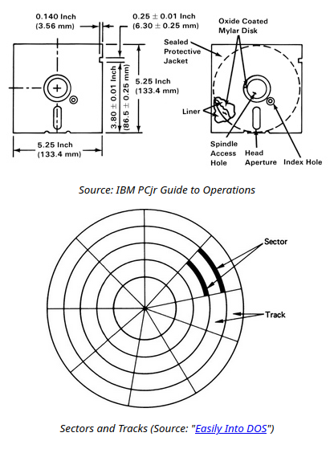

# Floppy Overdrive - Documentation

## Introduction

The main task of the floppy drive is to provide and record data pulses onto a disk, using a specialized magnetic head that reacts to changes in magnetization on the disk. The motion of the drive (i.e. spinning the disk and moving the heads across the disk) is determined by an external floppy disk controller (FDC), which is generally installed inside of a PC. 

## Format

The 5.25-inch floppy disk stores data on a protected magnetic disk, using changes in magnetic flux to represent data. The disks is split up into several concentric rings, which are known as tracks. The first track is the outermost ring, with the track number increasing as they get closer to the center of the disk. These tracks are further subdivided into sectors, which has a specific number of bytes, depending on the logical format of the disk.

\
Source: [21] in the research document.

There are two important physical features of the disk: the write-protect notch in the top-right corner, and the index hole just to the right of the center spindle. The drive uses a phototransistor and LED at the write-protect notch to notify the FDC if the disks is allowed to be written to. The disk is not write-protected when this notch is present, and it is write-protected when this notch is missing or covered up. The index hole corresponds to the start of sector 0 on the disk. When the hole spins around to match the hole in  the casing, a brief pulse is produced, which is sent to the FDC, and is one method of identifying the start of a track.

For the PC, there are two major types of 5.25-inch disks: 1.2MB high density (HD) disks and 320kB double density (DD or 2D) disks. Double density disks generally have 40 tracks, whereas high density disks have 80 tracks. The two types also are meant to be spun up at different speeds: 300 rpm for DD and 360 rpm for HD.

Since these two disks differ internally, it is important to consider whether a drive is able to read DD or HD disks. Generally, most high density 5.25 PC drives will use a density select signal, which changes the speed of the spindle motor to spin the disk at 300 or 360 rpm. DD disks can usually be read using a HD drive, but since HD drives have a much smaller read head, it is not recommended to write to a DD disk in an HD drive.

More information can be found in sources [6] and [21].

## Communication

The PC floppy drives connects directly to the FDC controller using a 34-pin bus. While this bus was never formally standardized and some pins will have different functions between drives and FDCs, there are a few standard signals needed to operate the drive:

- Index (Pin 8): The signal generated by the index sensor inside of the drive, where each pulse indicates that the start of the track is currently under the head.

- Drive select 1-4 (Pins 10, 12, 14, 6): Enable signals for up to 4 drives, where each drive is set to a specific number 1-4. In practice, only 2 drives could be connected to most FDCs, and each drive was set internally to drive 1, using a twist in the cable to swap one drive to drive 0. When a drive is not selected, it should not respond or send any signals on the bus.

- Motor on (Pin 16): The enable signal for the spindle motor, which can be activated independently of the drive select signal.

- Direction (Pin 18): Selects the direction of the magnetic head when a set pulse is sent. A low signal (ground) moves the head towards the center of the disk, while a high signal (+5V) moves it away from the center.

- Step (Pin 20): A low-level pulse on this line will cause the drive to step the head by one track on a rising edge.

- Track 0 (Pin 26): The signal created by the track 0 sensor of the drive, which indicates that the head is currently at track 0 of the disk.

- Write protect (Pin 28): The signal created by the write-protect sensor, where a low signal indicates that the current disk is write-protected.

- Read data (Pin 30): Used to send out the data pulses generated by the drive.

- Side select (Pin 32): Used by the FDC to tell the drive what side of the disk to read from. Side 0 (the upper head(?)) corresponds to a high signal, and side 1 corresponds to a low signal.

Only the even-numbered pins are used for communication, with all of the odd-numbered pins being connected to ground. Additionally, FDCs appear to mainly use +5V active-low logic, which should be accounted for when interfacing with the bus. When enabled, the drive should immediately react to any control signals and output the current state of the sensors.

More information about the floppy bus can be found in source [9].

## Control Circuit

The portion of the drive responsible for controlling the components and sensors of the drive is referred to as the control circuit. This is the more digital side of the drive, and for the most part consists of combinational logic. This section will specifically describe the behvaior of this circuit for the MF-504 drive, as is implemented on the control board.

Most of the sensors on the drive use phototransistors and LEDs to determine their states. All LEDs and transistors are able to be powered by +3.3V, with the exception of the index LED, which is on the spindle motor and is powered by its +12V supply. The write-protect and index signals are found on connector J4 of the PCB, while track 0 is on J6, the same header as the stepper motor. The disk sensor is a microswitch placed at the read of the drive, and is also connected at J4. All of the signals are active-high, expect for the index signal, which will be normally high but pulse low when the index hole is present.

The original schematics for wiring the drive sensors.

The logic for the sensors converts all inputs to be active-low, then ANDs them with the correct drive select line to determine whether to send their outputs. THe drive number is determined by a localparam in the control circuit module, which can be set manually before programming the FPGA.

The spindle motor is powered by +12V, but is able to use +3.3V logic. The motor has a speed and enable control on pins 1 and 3 of J2, respectively.
The motor will be disabled when pin 3 is low and begin spinning when high. When the speed control is low, the motor will spin at 300 rpm, and when it is high, the drive will spin at 360 rpm.

Since the control signal for the spindle motor is independent of the drive select, the motor signal from the bus is simply inverted to be active-high and sent directly to the motor. Similarly, the density signal is passed directly through the circuit to the speed control, as the levels for the signal on the bus match that of the motor itself.

The stepper motor of this drive is a four-wire unipolar stepper motor, also powered by +12V. A ULN2003 transistor array is used as the driver for this motor, which grounds a wire on the motor when the FPGA drives the corresponding input signal. In order to step the head forwards or backwards, one pin st a time must be grounded in sequence. For instance, grounding pin 1, then 2, then 3, then 4, then 1 again and so on would step the heads towards the center of the disk. Alternating the pins in the opposite order would result in the head moving away from the center of the disk. Each step should occur on the rising edge of a step pulse, and the direction of the step should be determined on this rising edge from the bus input.

More information on driving the stepper motor can be found in source [16].

A sub-circuit (step_driver_deb) has been created to drive the stepper motor. This circuit uses an FSM to detect the falling edge of a step pulse. It then waits for a certain number of cycles before checking if the pulse is still low to confirm that the step was valid and not just a result of bouncing. The FSM them waits for the step line to rise, and then changes the current coil according to the direction input. Due to potential issues with metastability on the step and direction inputs, a dual-flop synchronizer is used on both these inputs to ensure that there is a valid input to the FSM. THe pins ofn the FPGA corresponding to the four coils are wired directly to the ULN2003C, which in turn are connected to the stepper motor. 4 LEDs are also included on the control board to aid in identifying the currently grounded coil. These LEDs can be disabled by removing jumper JP1.

## Read Circuit

The read portion of the drive converts the waveform generated by the disks in the magnetic head to a series of encoded data pulses that the FDC can then decode into usable data.

Block diagram for a traditional read circuit [13].

The first portion of the read circuit is an amplifier that brings the voltage in the heads up from 1-2 mV to 100-200 mV. The signal produced will somewhat resemble a sine wave, where each of the peaks of the signal will correspond to a single data pulse. The signal from the magnetic heads will be a differential signal, centered at whatever the center voltage of the head is set to (Pin A2/B2, J5). For testing,  the center voltage was set to ground, and two THS4521 op-amps were used to produce a total of x100 gain on the signal, with a differential output.

The output of the preamplifier when connected to the magnetic heads. Only the positive end of the differential signal is connected here.

The data pulses correspond to each of the positive and negative peaks of this wave form. In the original analog circuitry, this signal would first be passed through a Pi filter, and then differentiated. This would convert the peak voltages into zero-crossings. A comparator would then be used to generate a square wave depending on whether the signal was above or below 0V. Each transition of the comparator would then trigger a pulse generator and a time-domain filter to generate the necessary pulses.

Source [13] goes much more in detail about how the data pulse recovery was performed in the original hardware.

A more descriptive set of diagrams for the read circuit [13].

Since an FPGA is being used for this project, a more digital approach to peak detection was tested, where the amplified signal would be read in using a high-speed ADC, and a data pulse would be generated when the ADC provided a value above or below a certain threshold.

To develop and test this circuit, the LTC1420, a 12-bit 10MSPS analog-to-digital converter, was chosen due to its parallel interface to the FPGA. This allowed for simpler communication logic than a serial ADC, and required a much lower clock speed for the FPGA while still sampling at a high frequency. The Verilog code written for the read circuit contained an FSM that would first read from the ADC, then pulse the data output and wait for a few microseconds when the ADC’s output passed the threshold before returning the the read state, where the FSM would remain until the output exceeded the threshold again.

During testing, it was found that the ADC would provide inconsistent maximum and minimum values, causing the pulses for the high and low peaks to be out of sync, producing a data pulse at inconsistent intervals. Additionally, the FPGA would occasionally produce a second pulse immediately after the first. This was reduced by increasing the threshold levels and adding a delay after ending the pulse, but the problem was not able to be solved fully. Possible sources of error include a lack of filtering on the input signal and improper wiring/ground decoupling of the ADC. All of the code used to test this circuit is provided in this repository under /hw/ADC_test.

The ADC during testing, with only the MSB wired to the FPGA.
