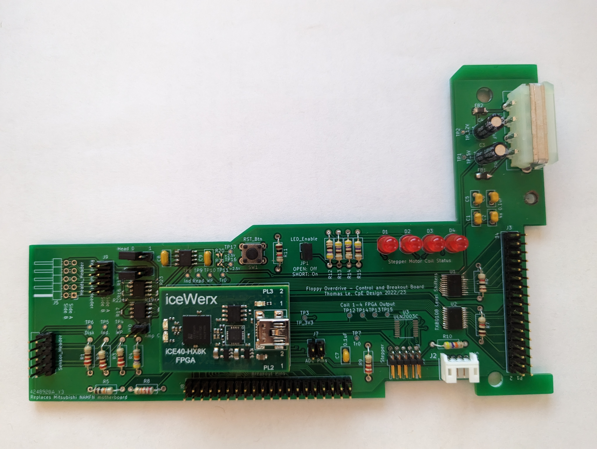

# Project Status (as of April 2023)

The assembled PCB.

## PCB Issues

During testing, it was found that some aspects of the board do not function exactly as expected and will require later revisions to the design:

- The +/- 2.5V voltage generator (IC3, R20-21, C8-9) does not function and will not provide the correct voltages. When assembling the board, these components should be left unsoldered. The preamplifier circuit, however (IC1-2), does work as intended with the correct voltages, and can be powered directly from TP16-17 using an external power supply.

- When connecting the board to an ArduinoFDC, some pins will require extra pull-up resistors to +5V to prevent floating. This was noted in the motor enable signal, which would not return to +5V when the motor was disabled manually without this extra resistor. In testing, having all control lines appeared to provide good results, except for the Index signal, which would not provide a consistent waveform with this extra resistor. Further research into the traditional signal termination methods should be researched to resolve this issue.

- The new board will not lie flat in the drive without drilling an extra hole to fit the key pin at the read end of the drive. This has been corrected in the current KiCad project files, but should be noted when using the old revision of the board.

- Pin 39 on the breakout header is meant to be connected to +3.3V, but is not connected to any net. If desired, this can be solved by scratching off the silkscreen on the bottom layer to expose the +3.3V plane and soldering the pin directly. THis is also fixed in the current KiCad project files.

## Remaining Work

Most remaining work involves completing the read circuit. The preamplifier is done, but the peak detection still needs to be properly implemented. If the ADC can be properly interfaced with the FPGA, software peak detection in Verilog could still be an option for generating the read pulses. However, a better analog engineer might be able to more properly implement the filter, differentiator, and zero-crossing circuits used in the original hardware. The one-shots used for the time domain filter do not appear to be manufactured anymore, but they could probably be reimplemented in the FPGA, since at that point they are already just digital signals.

There also still needs to be a way to select between the different heads. One option would be to implement the entire circuit twice and mux the output in the FPGA, but obviously this is not a very elegant solution. The AN917 document discusses a few methods of disk selection, including using either diodes or FETs to enable one head or the other.

As was mentioned above, the input bus should be modified to match the specifications of the original drive and enure floating is not an issue. The standard specifications for the drive should provide some information on how to properly implement the input and output lines.

Once the read circuit is implemented, the entire design should be tested again using the ArduinoFDC to see if it is able to read any data, and then tested on real hardware to see if it is able to interface with an actual controller and computer.

Once the board functionality is completed, there is some room for expansion with the project. One idea might be to include a microcontroller on the board with the ArduinoFDC software installed, allowing the drive to function as a USB device so it can work without needing an external FDC. I also think there would be some merit to creating a method of recording the read waveforms of the heads as a different approach to archiving disks fully and in a way that might allow bad data to be better recovered.

